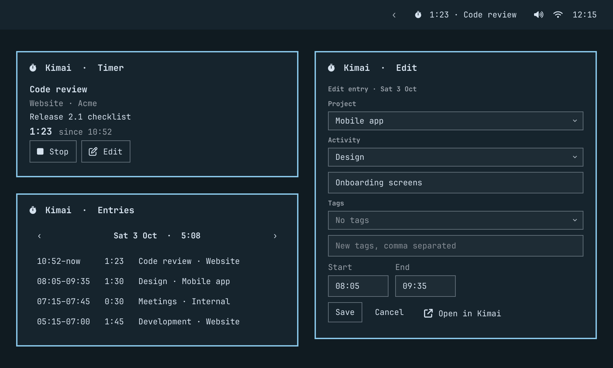

# Kimai for Omarchy



An unofficial [Kimai](https://www.kimai.org) time-tracking widget for the
[Omarchy](https://omarchy.org) bar. It shows the running timer in the bar and
lets you start, stop, restart and edit timesheets from a popup. It works with
any Kimai 2 server that has API tokens enabled.

- **Bar:** `󱎫  1:23 · Code review`. Left-click opens the popup, middle-click
  stops the timer (or restarts the last one), right-click opens Kimai in your
  browser.
- **Timer tab:** stop or edit the running timer. When idle, start a new one
  (project, activity, description, tags) or restart a recent entry with one
  click.
- **Entries tab:** a day's entries with the day total. Use ‹ › to step back
  through earlier days, and click an entry to edit it.
- **Settings tab:** server URL, API token, refresh interval and label width.

## Install

```bash
omarchy plugin add https://github.com/morawskimck/omarchy-kimai --enable
```

The widget appears on the right side of the bar. Click it, open **Settings**,
and enter:

1. **Server URL:** for example `https://kimai.example.com`.
2. **API token:** in Kimai, click your avatar, open **API Access** and create
   a token.

Press **Connect**. The widget shows `Connected as <you> · Kimai <version>`.

Update with `omarchy plugin update io.github.morawskimck.kimai`. Remove with
`omarchy plugin remove io.github.morawskimck.kimai`. The plugin's settings are
kept after removal, so also delete `~/.config/omarchy-kimai/`, and delete the
keyring entry with `secret-tool clear application omarchy-kimai url <url>`.

## Keybindings

The plugin exposes IPC commands you can bind in `~/.config/hypr/bindings.lua`:

```lua
o.bind("SUPER + ALT + T", "Kimai: start/stop", "omarchy-shell kimai toggle")
o.bind("SUPER + ALT + SHIFT + T", "Kimai: open", "omarchy-shell shell toggle io.github.morawskimck.kimai")
```

| Command | Effect |
|---|---|
| `omarchy-shell kimai toggle` | Stop running timers, or restart the most recent entry |
| `omarchy-shell kimai stop` | Stop running timers |
| `omarchy-shell kimai restartLast` | Restart the most recent entry |
| `omarchy-shell kimai refresh` | Sync now |
| `omarchy-shell kimai status` | JSON status for scripts |

## Privacy and security

- The API token is stored in your login keyring with `secret-tool` (attributes
  `application=omarchy-kimai`, `url=<server>`). It is never written to a file.
- The token is never passed on a command line, so it doesn't appear in `ps`;
  it is handed to `curl` on stdin.
- Omarchy's default keyring has no password. The token is protected by your
  user account's file permissions, not encrypted at rest. Set a keyring
  password in Seahorse if you want that.
- `~/.config/omarchy-kimai/config.json` holds only the server URL and display
  preferences.
- Only `https://` servers are accepted, plus `http://localhost`.

## Requirements

Omarchy 4 (tested on 4.0.4 with Quickshell 0.3.1), and Kimai 2 with API tokens
(tested on 2.67.0). The plugin uses `curl`, `secret-tool` (libsecret),
`xdg-open` and Omarchy's own `omarchy-notification-send`, all of which Omarchy
ships. It needs no extra packages and no privileges.

## Known limits

- Deleting entries, moving an entry to another date, and creating customers,
  projects or activities are left to the Kimai web UI. "Open in Kimai" in the
  edit form takes you there.
- New tags typed in the popup are created in Kimai before the entry is saved,
  so your Kimai account needs permission to create tags. Without it, the save
  stops with a message instead of silently dropping the tag.
- The server's TLS certificate must be valid (self-signed certificates are
  rejected by `curl`).
- Times are shown as Kimai stores them, in your Kimai profile's timezone.
  Settings warns you if that differs from your computer's timezone.

## Development

From the root of a working copy of this repository:

```bash
scripts/check.sh      # unit tests (node), qmllint, UI + service tests, manifest validation
scripts/ui-test.sh /tmp/kimai-ui   # UI tests only; keeps the screenshots
scripts/service-test.sh            # Service.qml against a mock Kimai (no real server or keyring)
scripts/preview.sh                 # regenerate preview.png with demo data
scripts/dev-link.sh   # symlink into ~/.config/omarchy/plugins and rescan
journalctl --user -t omarchy-shell -f   # QML errors and console.log
```

Symlinked plugins are not hot-reloaded. Run `scripts/dev-link.sh` again (or
`omarchy-shell shell rescanPlugins`) after each edit.
`scripts/kimai-api.sh GET /timesheets/active` calls the API with the stored
token.

`Model.js` holds all pure logic and is tested with `node --test`. The QML
files are thin: `Service.qml` runs once and owns state, polling and API calls,
while `BarWidget.qml` and `Panel.qml` (with `views/`) render it.
`tests/ui/` renders the real views offscreen against a mock service
(`MockService.qml`) and clicks through them. `tests/service/` runs the real
`Service.qml` headless against a small Kimai double (`mock-kimai.js`) with a
fake `secret-tool`. Neither needs a Kimai server or touches your keyring.

### Manual test checklist

Run through this before a release, against a test Kimai account.

- [ ] Connect with a wrong token, then a wrong URL, then the right one. Each
      shows a clear message.
- [ ] Start from the Timer tab, including a new tag. The bar updates
      immediately.
- [ ] Stop. Restart from Recent; the description and tags are copied.
- [ ] Edit the running timer's description and start time. Kimai's web UI
      shows the change.
- [ ] Edit a finished entry from the Entries tab. "End before start" shows an
      error.
- [ ] A timer started in Kimai's web UI appears in the bar within one refresh
      interval.
- [ ] Take the server offline: the bar dims and the tooltip says Offline. When
      the server is back, it recovers by itself.
- [ ] With two monitors, the proxy log shows one `/api/timesheets/active` per
      interval, not two.
- [ ] The token never appears in `ps` output, in `shell.json` or in
      `config.json`.
- [ ] In punch mode (Kimai system settings), the time fields are hidden.

## License

MIT
